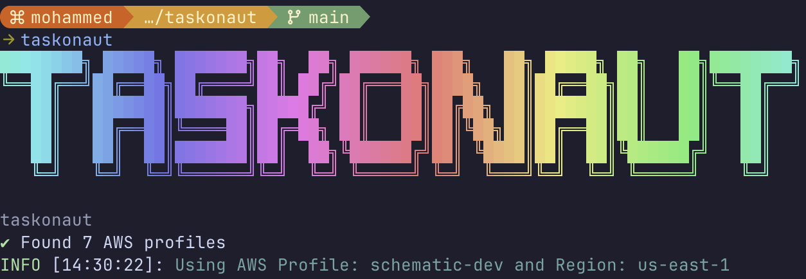

# taskonaut

```bash

░██████╗░█████╗░██╗░░██╗███████╗███╗░░░███╗░█████╗░████████╗██╗░█████╗░
██╔════╝██╔══██╗██║░░██║██╔════╝████╗░████║██╔══██╗╚══██╔══╝██║██╔══██╗
╚█████╗░██║░░╚═╝███████║█████╗░░██╔████╔██║███████║░░░██║░░░██║██║░░╚═╝
░╚═══██╗██║░░██╗██╔══██║██╔══╝░░██║╚██╔╝██║██╔══██║░░░██║░░░██║██║░░██╗
██████╔╝╚█████╔╝██║░░██║███████╗██║░╚═╝░██║██║░░██║░░░██║░░░██║╚█████╔╝
╚═════╝░░╚════╝░╚═╝░░╚═╝╚══════╝╚═╝░░░░░╚═╝╚═╝░░╚═╝░░░╚═╝░░░╚═╝░╚════╝░
```



Interactive CLI tool for exec into AWS ECS tasks (containers), rollback services to previous task definition revisions, and clean up unused task definitions - from [SchematicHQ](https://schematichq.com)

> `taskonaut` is a combination of "Task" (ECS tasks) and "Astronaut"
> We followed [Command Line Interface Guidelines](https://clig.dev/), An open-source guide to help you write better command-line programs, taking traditional UNIX principles and updating them for the modern day.

## Features

- 🔐 AWS SSO authentication support
- 🚀 Interactive cluster selection
- 📦 Task listing and selection
- 🐳 Container execution
- ⚙️ Profile and region management
- 💾 Persistent configuration
- 🎨 Beautiful CLI interface
- 📍 Navigation between clusters, tasks, and containers.
- 🔄 **ECS Service Rollback** - Rollback services to previous task definition revisions
- 🗑️ **Task Definition Pruning** - Clean up unused task definition revisions with smart protection

## Prerequisites

> [!WARNING]
> Make sure you have met the [Amazon ECS Exec prerequisites](https://docs.aws.amazon.com/toolkit-for-jetbrains/latest/userguide/ecs-exec.html#ecs-exec-prereq).

- Node.js 18+
- AWS CLI v2
- AWS Session Manager Plugin
- AWS credentials configured (supports AWS SSO, access keys, etc.)

## Installation

### Recommended: Global Installation

```bash
npm install -g @schematichq/taskonaut
```

### Local Installation from Source

For development or if you prefer to install from source:

```bash
# Clone the repository
git clone https://github.com/SchematicHQ/taskonaut.git
cd taskonaut

# Install dependencies and install globally from source
npm install
npm install -g .
```

After installation, you can use `taskonaut` command globally just like the npm package installation.

> **Note**: The global npm installation method is recommended for most users as it provides automatic updates and easier management.

## Usage

```bash
# Configure AWS profile and region
taskonaut config set

# Show current configuration
taskonaut config show

# Clear configuration
taskonaut config cleanup

# Run diagnostics to check environment setup
taskonaut doctor

# Rollback ECS service to previous revision
taskonaut rollback

# Clean up unused task definition revisions
taskonaut prune

# Start interactive session
taskonaut
```

## Command Line Options

```bash
Usage: taskonaut [options] [command]

✨ Interactive ECS task executor, rollback tool, and task definition cleanup utility

Options:
  -h, --help  display help for command

Commands:
  config      Manage configuration settings
  doctor      Run diagnostics to check your environment setup
  rollback    Rollback an ECS service to a previous task definition revision
  prune       Clean up unused task definition revisions
```

## Configuration

Configuration is stored in:

- macOS: `~/Users/$USER/Library/Preferences/taskonaut-nodejs`
- Linux: `~/.config/taskonaut-nodejs`
- Windows:`%APPDATA%\taskonaut-nodejs`

## 🔄 ECS Service Rollback

The rollback feature allows you to safely revert ECS services to previous task definition revisions with an interactive, step-by-step process.

### How Rollback Works

1. **Select Cluster** - Choose from available ECS clusters
2. **Select Service** - Pick the service you want to rollback
3. **Choose Target Revision** - Select which previous revision to rollback to
4. **Preview Changes** - Review detailed comparison of current vs target:
   - Task definition revisions and creation dates
   - CPU and memory differences
   - Container image changes with tags
5. **Confirm Rollback** - Final confirmation before executing
6. **Execute & Monitor** - Rollback initiated with status tracking

### AWS Rollback Mechanism

taskonaut uses AWS ECS's native rollback capability by calling `updateService` with a previous task definition ARN. This is the same mechanism used by:

- AWS Console's "Update Service" → "Revision" selection
- AWS CLI's `aws ecs update-service --task-definition previous-revision`
- AWS SDKs and CloudFormation rollbacks

### Usage Examples

```bash
# Interactive rollback with step-by-step guidance
taskonaut rollback

# Example flow:
# 1. Select cluster: production-cluster
# 2. Select service: api-service (revision 245 → rollback available)
# 3. Choose target: Revision 243 (created 2 hours ago)
# 4. Review changes: image tags, CPU/memory differences
# 5. Confirm: "Proceed with rollback? (245 → 243)"
# 6. Execute: Rollback initiated with deployment tracking
```

### 📋 Important AWS Configuration

> [!IMPORTANT]
> **Task Definition Retention**: To enable rollback functionality, your infrastructure should retain old task definition revisions. If using Pulumi, Terraform, or similar IaC tools, configure:

**Pulumi:**

```typescript
const taskDefinition = new aws.ecs.TaskDefinition("my-task", {
  // ... other configuration
  skipDestroy: true, // Retains old revisions when updating
});
```

**Terraform:**

```hcl
resource "aws_ecs_task_definition" "my_task" {
  # ... other configuration
  skip_destroy = true
  lifecycle {
    create_before_destroy = true
  }
}
```

**Why This Matters:**

- Without `skipDestroy: true`, old task definition revisions are deleted during updates
- Rollback requires access to previous revisions (AWS keeps them for 1 year by default)
- This setting ensures your rollback history is preserved for operational safety

### Rollback Safety Features

- **Multiple Confirmations** - Prevents accidental rollbacks
- **Detailed Previews** - Shows exactly what will change
- **Container Image Tracking** - Displays image tags for easy identification
- **Deployment Monitoring** - Provides AWS CLI commands for status tracking
- **Graceful Cancellation** - Cancel at any step without changes

## 🗑️ Task Definition Pruning

The pruning feature helps you clean up unused task definition revisions to reduce clutter and manage AWS ECS resources efficiently. It provides an interactive, safe way to delete old revisions while protecting critical ones.

### Why Prune Task Definitions?

- **Reduce Clutter**: AWS ECS can accumulate hundreds of task definition revisions over time
- **Easier Management**: Fewer revisions make it easier to find and manage active configurations
- **Cost Optimization**: While task definitions themselves don't incur costs, reducing them helps keep your AWS environment organized
- **Compliance**: Some organizations require cleanup of unused resources

### How Pruning Works

1. **Select Task Definition Family** - Choose which task definition family to clean up
2. **Optional Service Usage Check** - Optionally select a cluster to identify revisions currently in use
3. **Analyze Revisions** - View all revisions with protection status:
   - ✅ **LATEST** - Latest revision (always protected)
   - 🛡️ **IN-USE** - Currently used by services (protected if cluster checked)
   - 📌 **KEEP** - Within latest 5 revisions (recommended to keep, but can uncheck)
   - ⚠️ **INACTIVE** - Not in use, eligible for deletion
   - 🔄 **ACTIVE** - Will be deregistered first, then deleted
4. **Manual Selection** - Interactive checkbox interface to select revisions to delete
5. **Dry-Run Preview** - Detailed summary of what will happen:
   - Protected revisions (will NOT be deleted)
   - Revisions to keep
   - Revisions to deregister (ACTIVE → INACTIVE)
   - Revisions to delete (INACTIVE → permanently removed)
6. **Type-to-Confirm** - Type the task definition family name to confirm
7. **Final Confirmation** - One last yes/no confirmation before execution
8. **Execution** - Two-phase deletion:
   - Phase 1: Deregister ACTIVE revisions (marks as INACTIVE)
   - Phase 2: Delete INACTIVE revisions (permanent removal)
9. **Results Summary** - Success/failure counts with detailed error reporting

### AWS Deletion Mechanism

Taskonaut uses AWS ECS's native two-step deletion process:

1. **Deregister** (`deregisterTaskDefinition`): Marks a task definition as INACTIVE
   - INACTIVE task definitions cannot be used to run new tasks or create services
   - Existing tasks/services continue to run normally
   - Required before permanent deletion

2. **Delete** (`deleteTaskDefinitions`): Permanently removes INACTIVE task definitions
   - Transitions revisions to DELETE_IN_PROGRESS status
   - Final removal happens when all associated tasks/services are terminated
   - Batch operation (up to 10 revisions at once for efficiency)

### Usage Examples

```bash
# Interactive pruning with all safety checks
taskonaut prune

# Example flow:
# 1. Select family: my-api-service
# 2. Check service usage in production-cluster? Yes
# 3. View analysis: 50 total, 2 protected, 5 keep, 43 eligible
# 4. Select revisions: (pre-checked: revisions outside latest 5)
# 5. Review dry-run: Will deregister 10, will delete 33
# 6. Type to confirm: my-api-service
# 7. Final confirmation: Yes
# 8. Execute: Deregister → Delete → Results
```

### Protection & Safety Features

#### 🛡️ Automatic Protection

- **Latest Revision**: Always protected, cannot be selected
- **In-Use Revisions**: Protected if service usage check is performed
- **Latest 5 Policy**: Revisions within the latest 5 are pre-unchecked (but can be manually selected if needed)

#### 🔒 Multiple Confirmation Gates

1. **Visual Review**: See all revisions with clear status badges
2. **Dry-Run Preview**: Detailed breakdown before execution
3. **Type-to-Confirm**: Must type exact family name
4. **Final Yes/No**: Last chance to cancel

#### 🎯 Manual Control

- **Checkbox Interface**: Full control over which revisions to delete
- **Smart Pre-selection**: Automatically suggests INACTIVE revisions beyond latest 5
- **Override Capability**: Can uncheck pre-selected items or check items within latest 5
- **Disabled Protection**: Protected revisions are visually disabled and cannot be selected

#### 📊 Detailed Reporting

- **Pre-deletion Analysis**: Shows total, protected, kept, and eligible counts
- **Phase-by-Phase Progress**: Real-time progress indicators during execution
- **Error Handling**: Continues processing on individual failures, reports all errors at end
- **Verification Commands**: Provides AWS CLI commands to verify results

### Best Practices

1. **Regular Cleanup**: Run `taskonaut prune` periodically (monthly/quarterly) to prevent accumulation
2. **Check Service Usage**: Always check service usage to avoid deleting revisions in use
3. **Keep Latest 5**: The default "keep latest 5" policy provides a good balance of history and cleanliness
4. **Start Conservative**: On first use, only delete very old INACTIVE revisions
5. **Verify Results**: Use the provided AWS CLI command to verify cleanup was successful
6. **Document Deletions**: Note which revisions were deleted for audit purposes

### Edge Cases Handled

- ✅ Task definition with only 1 revision (protected automatically)
- ✅ All revisions in use (nothing to delete, graceful exit)
- ✅ No INACTIVE revisions (only deregister operation performed)
- ✅ Partial deletion failures (continues processing, reports at end)
- ✅ No cluster provided (only latest revision protected)
- ✅ User cancellation at any step (graceful exit, no changes)

### Important Notes

> [!WARNING]
> - **Deletion is permanent**: Deleted task definitions cannot be recovered
> - **Deregister is reversible**: INACTIVE revisions can still be updated or deleted later
> - **Service impact**: Deleting an in-use revision won't affect running services, but always check usage first
> - **Batch operations**: Delete operations process up to 10 revisions at a time for efficiency

> [!TIP]
> - **First time users**: Start by only deleting revisions that are more than 6 months old
> - **Keep history**: Consider keeping at least 10 revisions for rollback flexibility
> - **Infrastructure as Code**: If using IaC tools, ensure `skipDestroy: true` is set to preserve revision history

### Handling Large Revision Sets (500+)

Taskonaut is optimized for handling large revision sets with built-in rate limiting:

**Automatic Rate Limiting:**
- **Analysis phase**: 20 revisions per batch with 500ms delay between batches
- **Pagination**: 100 revisions per page with 100ms delay between pages
- **Deregister operations**: 200ms delay between each call, 3 retry attempts with exponential backoff (1s, 2s, 4s)
- **Delete operations**: Batch of 10 with 300ms delay, 3 retry attempts with exponential backoff (1s, 2s, 4s)

**For 500+ Revisions:**
- ✅ Full pagination support - fetches ALL revisions
- ✅ Progress indicators show real-time status
- ✅ Automatic throttling prevents API rate limit errors
- ✅ Expected time: ~30-60 seconds for 500 revisions
- ✅ Bulk selection options avoid overwhelming UI

**Best Practices for Large Sets:**
1. Use bulk selection options (e.g., "All INACTIVE beyond latest 5")
2. Consider age-based cleanup (e.g., "older than 90 days")
3. Use revision range for targeted cleanup (e.g., revisions 1-400)
4. Avoid manual checkbox selection with 500+ items

**If Rate Limiting Occurs:**
- Tool automatically retries with exponential backoff
- Progress messages show retry attempts
- If persistent, wait a few minutes and try again
- Consider using more specific filters to reduce API calls

## AWS authentication

### `aws sso login`

```bash
aws sso login --porfile PORFILE_NAME
taskonaut
```

### `assume`

- TBD

### `vault`

- TBD

## Troubleshooting (macOS)

> [!CAUTION]
> Error messages:

- `Task not found`: Ensure the ECS task is running
- `Container not found`: Task may have zero containers
- `Invalid AWS profile`: Configure AWS profile first
- `No clusters found`: Ensure you have access to ECS clusters in the selected AWS region.
- `No tasks found in cluster`: The selected cluster has no running tasks. taskonaut will offer options to go back and select a different cluster or check your AWS Console for running tasks.
- `AWS CLI is not installed`: Install AWS CLI v2.
- `Session Manager Plugin is not installed`: Install the Session Manager Plugin.
- `AWS initialization failed`: Check your AWS credentials and network connectivity.
- `No services found in cluster`: Ensure the cluster has running services.
- `No other revisions available for rollback`: The service only has one task definition revision, or old revisions were deleted (see `skipDestroy` configuration above).
- `Rollback failed`: Check ECS service permissions and ensure the target task definition revision still exists.
- `Unable to start command: Failed to start pty: fork/exec /bin/sh: no such file or directory`: Container doesn't have a shell (common with minimal containers like Twingate connectors, distroless images). These containers can't be accessed via exec.
- `No task definition families found`: No task definitions exist in your AWS account/region. Ensure you have deployed at least one ECS service.
- `No revisions available for deletion`: All revisions are either protected (latest/in-use) or within the latest 5. This is normal for recently created task definitions.
- `Failed to deregister task definition`: Ensure you have `ecs:DeregisterTaskDefinition` IAM permission.
- `Failed to delete task definition`: Task definition must be deregistered (INACTIVE) before deletion. Ensure you have `ecs:DeleteTaskDefinition` IAM permission.
- `Pruning operation partially failed`: Some revisions may be in use or locked. Check the detailed error messages and try again later.

---

- `AWS CLI not found`

```bash
brew install awscli

```

- `Session Manager Plugin not found`

```bash
brew install session-manager-plugin
```

- `Invalid AWS profile`
  Ensure your AWS profile is configured correctly. If using AWS SSO, log in with:

```bash
aws sso login --profile your-profile
```

- `AWS Credentials not configured`

  Configure your AWS credentials by setting up your `~/.aws/credentials` and `~/.aws/config` files. You can use aws configure to set up access keys, or set up AWS SSO profiles.

- `No clusters found`

  Ensure you have access to ECS clusters in the selected AWS region and that your AWS credentials have the necessary permissions.

### ECS Exec Checker from AWS

<https://github.com/aws-containers/amazon-ecs-exec-checker>

```bash
bash <( curl -Ls https://raw.githubusercontent.com/aws-containers/amazon-ecs-exec-checker/main/check-ecs-exec.sh ) <YOUR_ECS_CLUSTER_NAME> <YOUR_ECS_TASK_ID>
```

## License

MIT

## Contributing

Pull requests welcome! Please read `CONTRIBUTING.md` for details.

## Dependabot

We use [Dependabot](https://dependabot.com/) to keep our dependencies up to date.

## Semantic Release

We use [Semantic Release](https://semantic-release.gitbook.io/semantic-release/) to automate the release process.

## GitHub Actions

We use [GitHub Actions](https://github.com/features/actions) to run our tests and build our project.

## ToDo

- [ ] Add support for `aws-vault`
- [ ] Add rollback history tracking
